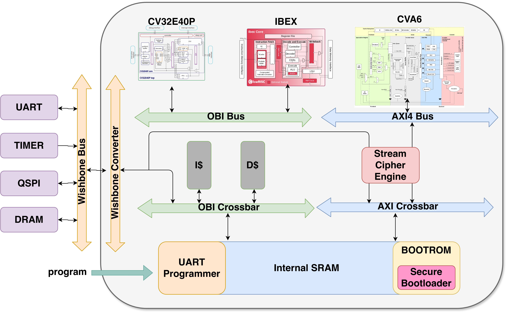
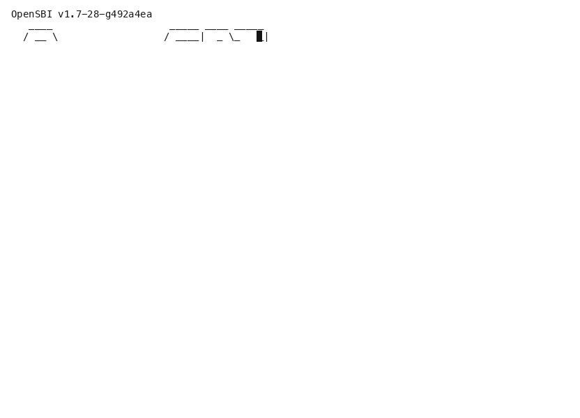
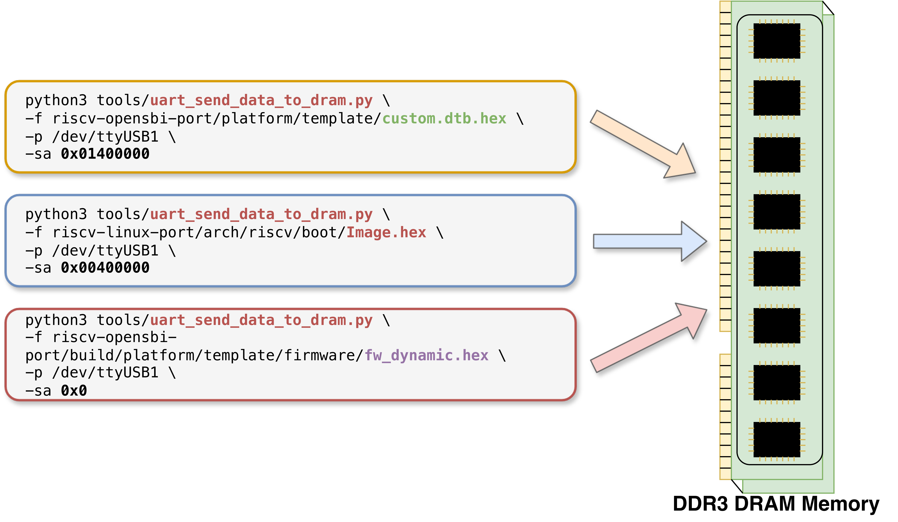
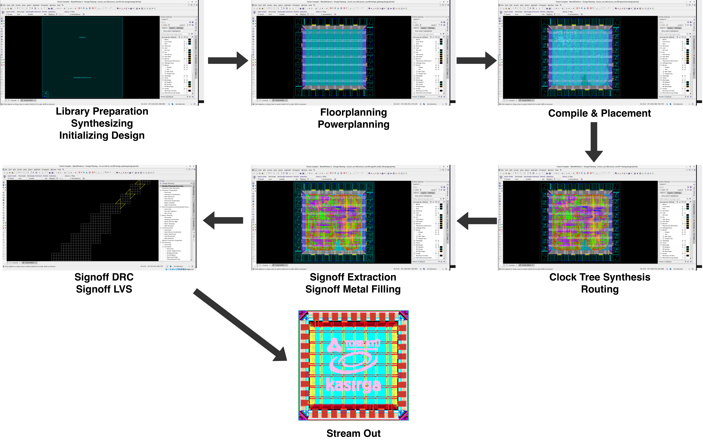
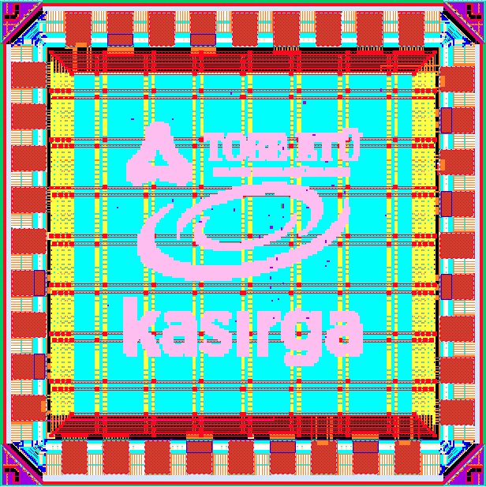

# secure-soc

RISC-V SoC with secure boot and on-the-fly memory encryption-decryption. The SoC can be built around one of CVA6, CV32E40P or Ibex cores for different class of CPUs. CVA6 supports M, S and U modes and has RV32IMAC extensions, so booting linux but CV32E40P and Ibex cores support just M mode and RV32IMC extensions, you can just run baremetal codes on these cores.

## Citation

You can cite the paper (accepted but not published yet) as:

```bibtex
@inproceedings{celik2026risc,
  title={A RISC-V Memory Encryption Framework for Confidential Computing},
  author={Celik, Seyyid Hikmet and Bolat, Alperen and Demirli, Emre Hakan and Grosse Hokamp, Peer and Hui, Henry and Sezer, Sakir and Ergin, Oguz and Selcuk, Ali Aydin},
  booktitle={2026 IEEE 39th International System-on-Chip Conference (SOCC)},
  year={2026},
  organization={IEEE},
  note={to be published}
}
```



## Environment Setup

This repo uses a nix based environment and the tools needed for simulation and compilation (QuestaSim, riscv-gnu-toolchain, cocotb, Verilator and others) are built and installed automatically.

To install nix environment on your linux based operating system, run the following commands:

```bash
sh <(curl -L https://nixos.org/nix/install) --daemon
```

```bash
mkdir -p $HOME/.config/nix && touch $HOME/.config/nix/nix.conf && echo -e "\n# Added by script\nexperimental-features = nix-command flakes\nmax-jobs = auto\nuse-xdg-base-directories = true" | tee -a $HOME/.config/nix/nix.conf
```

Restart the system:

```bash
reboot
```

Check whether nix is installed:

```bash
nix-shell -p nix-info --run "nix-info -m"
```

Clone the repo and update the submodules:

```bash
git clone https://github.com/celuk/secure-soc
```

```bash
cd secure-soc
```

```bash
git submodule update --init --remote --recursive
```

Use the following command to activate the nix environment (like `conda activate`, it has to be used every time a new terminal is opened):

```bash
nix develop
```

The first time it will install the tools and this can take a while, but once they are installed you can reach the working environment in every new terminal without waiting.

**Note:** If you do not have a QuestaSim license on the host you are using, you need to obtain a license first to be able to use QuestaSim:

https://www.intel.com/content/www/us/en/docs/programmable/683472/22-1/and-software-license.html

While getting the license you need to enter the mac address of the host computer. (`ifconfig`)

Then, in `.bashrc` or every time you open a terminal:

```bash
export LM_LICENSE_FILE=<your-questa-license-file-with-full-path>
```

**Note:** Current default simulator is Cadence Xcelium -since it is the fastest I tried- instead of Intel Modelsim, since it is cocotb based you can change to any other simulator easily via small modifications in verification folder or via command line arguments. Since you cannot run Xcelium in nix environment without packaging it, you may need a conda environment that has cocotb and other necessary tools.

## Simulation

The core and defines has to be set in two places, in [`header.vh`](rtl/header.vh) and in [`main.py`](verification/sim/main.py) and also check [`Makefile`](Makefile) for other variables.

There are many possibilities-configurations working for this soc to simulate and run: base soc, phase1 (boot-crypt) (secure boot), phase2 (mem-crypt) (on-the-fly memory encryption for confidential computing), phase1+phase2 (securesoc), boot from dram, boot from qspi flash, secure boot from dram, secure boot from qspi flash, boot from sram, second sram instead of dram (there is always an sram for embedded bootrom (that is generated from different bootloader c codes) and second means here main memory of the soc), programming from uart instead of boot from an external memory. Some are here, some are commented in the codes and some are in my other old tryings like these (since I don't wanna lose any more time for an academic stuff that won't be a product and don't wanna pollute the repos with ai slop and burn tokens to gather them and polish, I am sharing them as is and anyone can benefit from different parts from them by a small effort):

https://github.com/celuk/cva-soc

https://github.com/celuk/air-soc-boot-ibex

Some basic simulation examples:

### e.g. cv32e40p, ibex with secure boot via QSPI + Phase 1

In [`header.vh`](rtl/header.vh) define `CORE_IBEX` or `CORE_CV32E40P`, define `QSPI_SIM`.

```bash
make compile secure_bootloader_qspi
```

```bash
make compile demo SECURE_BOOT=1
```

```bash
make sim secure_bootloader_qspi
```

### e.g. cva6 with basic DRAM boot + Phase 2

In [`header.vh`](rtl/header.vh) define `CORE_CVA6`, define `DRAM_SIM`, define `SECURE_LAYER2_PRINCE`.

```bash
make compile bootloader_dram
```

```bash
make compile demo DRAM=1
```

Give mem init file path in `ddr3.v`.

```bash
make sim bootloader_dram
```

After simulation you may check the trace logs in [`verification`](verification) folder. You can wait for a UART output that will print in the console and you can interrupt via CTRL+C after some time, you can set the time limit for sim in [`main.py`](verification/sim/main.py).

Instead of simulation, for FPGAs (ZC706 or BASYS3), you need to compile a correct bootrom like we are doing for the simulations and before an implementation remove the sim defines from [`header.vh`](rtl/header.vh).

## Linux Boot

For linux boot you may need to check those:

https://github.com/celuk/riscv-linux-from-scratch

https://github.com/celuk/riscv-linux-boot (OLD)






## ASIC

For ASIC done in TSMC 65nm with Synopsys Fusion Compiler you may need to check this:

https://github.com/celuk/synopsys-flow




